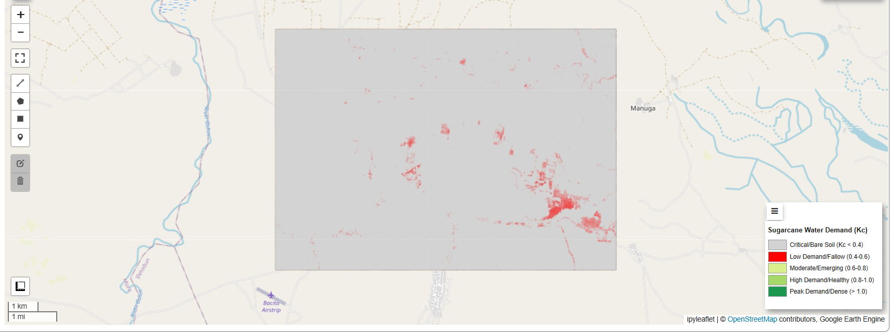
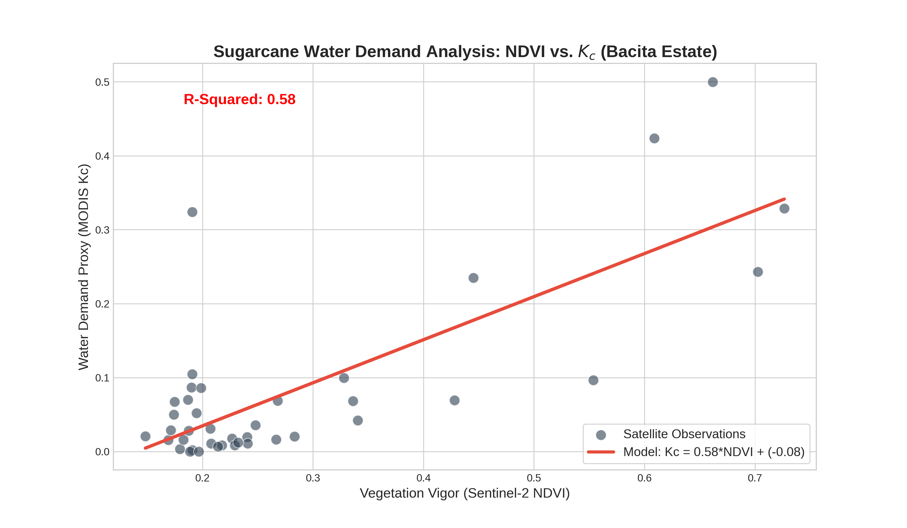
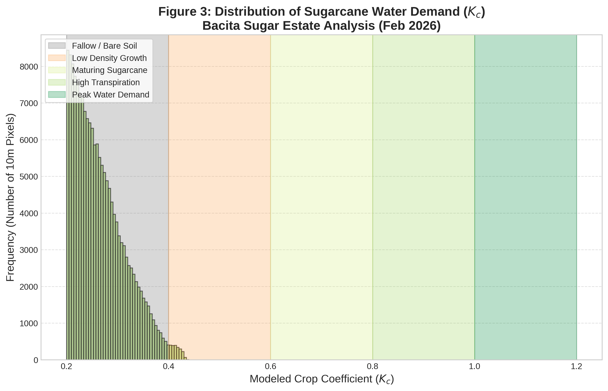

# GIS-Based Crop Coefficient ($K_c$) Estimation for Precision Agriculture

<p>

</p>

<p>

</p>

This project implements a **Remote Sensing & Machine Learning** pipeline to estimate spatial Crop Coefficients ($K_c$) in Bacita, Nigeria. By integrating Google Earth Engine (GEE) with local field data, the system models the relationship between spectral vegetation indices (like NDVI) and crop water requirements.

## 📌 Project Overview

Accurate estimation of evapotranspiration is vital for efficient irrigation scheduling. Traditional single-coefficient methods often fail to capture spatial variability in large fields. This project leverages satellite imagery and **Linear Regression** to map $K_c$ distribution, validating the results against ground-truth field data (`bacita_true_field_data.csv`).

## 🛠️ Tech Stack

* **Geospatial Engine:** Google Earth Engine (EE) API
* **Interactive Mapping:** Geemap
* **Data Manipulation:** Pandas, NumPy
* **Machine Learning:** Scikit-Learn (Linear Regression)
* **Visualization:** Matplotlib, Seaborn

## ⚙️ Key Features

* **Cloud-Native Processing:** Fetches and processes satellite imagery (Sentinel-2/Landsat) using GEE without local download.
* **Spectral Analysis:** Automatically calculates vegetation indices (NDVI, SAVI) to serve as predictors for $K_c$.
* **ML Calibration:** Uses `sklearn` to regress field-observed data against satellite indices to derive a localized predictive model.
* **Interactive Exports:** Generates static heatmaps and interactive HTML maps (`Bacita_Final_Project.html`) for field deployment.

## 📂 Methodology & Data

The workflow follows a standard remote sensing pipeline:

* **Input Data:**
    * **Satellite:** Multi-spectral imagery from Earth Engine.
    * **Ground Truth:** `data/bacita_true_field_data.csv` containing observed field measurements.
* **Processing:** Cloud masking -> Index Calculation -> Spatial Resampling.
* **Modeling:** $K_c = \alpha \times NDVI + \beta$ (calibrated via Linear Regression).

## 📁 Repository Structure

<pre>
├── data
│   └── bacita_true_field_data.csv     # Ground truth field measurements
├── results
│   ├── Bacita_Final_GIS_Plot.png      # Final spatial heatmap of Kc
│   ├── Bacita_Final_Project.html      # Interactive map export
│   ├── Bacita_Kc_Histogram.png        # Distribution of Kc values
│   └── Bacita_ML_Regression.png       # Model correlation plot (R² analysis)
├── crop_coe_estimation_gis.ipynb      # Main Jupyter Notebook
├── LICENSE
├── README.md
└── requirements.txt                   # Python dependencies (ee, geemap, etc.)
</pre>

## 🚀 Getting Started

### Prerequisites

**Python 3.9+** and a **Google Earth Engine Account**.

### 1. Clone the Repository

```bash
git clone https://github.com/Oluwatobi-coder/GIS-Crop-Coefficient-Estimation.git
cd GIS-Crop-Coefficient-Estimation

```

### 2. Install Dependencies

```bash
pip install -r requirements.txt

```

### 3. Run the Analysis

* Open `crop_coe_estimation_gis.ipynb`.

* Replace the `'YOUR_PROJECT_ID'` with a Google Cloud Console project which has Google Earth Engine API enabled

* Run the cells to fetch data, train the regression model, and generate maps.

## 🧠 Numerical Implementation

The analysis relies on correlating spectral reflectance with physiological crop properties:

1. **Feature Extraction:** Extracts pixel values at coordinates specified in the `bacita_true_field_data.csv`.
2. **Regression Analysis:** Fits a linear model to minimize Root Mean Square Error (RMSE) between satellite-derived indices and observed .
3. **Spatial Extrapolation:** Applies the trained model equation to the entire region of interest (ROI) to generate the final  map.

## 📊 Results

* **Model Accuracy:** The regression analysis correlates satellite indices with field data to establish validity.
* **Spatial Distribution:** The final output highlights zones of high water demand (High ) vs. stressed/low-density zones.

<p align="center">


</p>

## 🤝 Contributing

Contributions are welcome! If you want to integrate other satellite constellations (e.g., PlanetScope) or test non-linear ML models (Random Forest):

1. Fork the repository.
2. Create a feature branch (`git checkout -b feature-ml-models`).
3. Commit your changes.
4. Open a Pull Request.

## 📜 License

This project is licensed under the MIT License.

If you find this GIS analysis helpful for your research in precision agriculture, feel free to ⭐ the repository!
